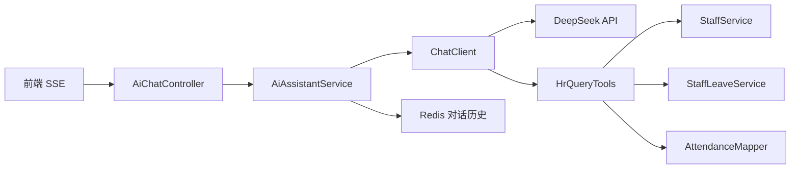

# AI 智能助手模块

基于 **Spring AI + DeepSeek + Tool Calling** 实现，支持自然语言查询 HR 数据。

## 架构



## 提供的 Tool

| Tool | 功能 |
|------|------|
| getEmployeeByName | 按姓名查员工档案（部门、工号、状态） |
| getMonthlyAttendance | 查某员工某月考勤统计（迟到/早退/旷工等） |
| getLeaveRecordsByStaffName | 查某员工请假记录 |

## 数据权限

接口层 `@PreAuthorize('ai:chat')` 控制「能否使用 AI」；Tool 层 `AiDataScopeService` 控制「能查谁的数据」。

| 范围 | 角色 | 可查询 |
|------|------|--------|
| ALL | admin、hr | 全公司员工 |
| DEPT | manager、ceo、cto 等部门负责人 | 本部门员工 |
| SELF | 其他 | 仅本人 |

```
用户提问 → AiChatController（接口权限）
         → HrQueryTools（Tool 调用）
         → AiDataScopeService.canAccess（数据权限）
         → 拒绝时返回【权限不足】，AI 原样转述
```

核心类：`ai/scope/AiDataScopeService.java`、`ai/tool/HrQueryTools.java`

查询当前用户数据范围：`GET /ai/scope`

## 接口

| 方法 | 路径 | 说明 |
|------|------|------|
| GET | `/ai/scope` | 当前用户 AI 数据查询范围 |
| GET | `/ai/chat/history` | 获取当前用户对话历史 |
| DELETE | `/ai/chat/history` | 清空对话历史 |
| POST | `/ai/chat` | 同步对话 |
| POST | `/ai/chat/stream` | SSE 流式对话 |

均需权限：`ai:chat`

## 配置步骤

### 1. 开启模块

`application.yml`：

```yaml
hrm:
  ai:
    enabled: true
```

### 2. 配置 API Key（勿提交 Git）

```bash
copy src/main/resources/application-local.yml.example src/main/resources/application-local.yml
```

编辑 `application-local.yml`：

```yaml
spring:
  ai:
    openai:
      api-key: 你的DeepSeek密钥
```

IDEA：**Active profiles** = `local`

### 3. 导入权限 SQL

```bash
mysql -u root -p hrm < src/main/resources/sql/ai-permission.sql
```

重新登录后，admin / HR 经理可见「智能助手」菜单。

## 测试问题示例

- `帮我查一下张三在哪个部门`
- `张三 2025 年 5 月考勤怎么样`
- `李四最近有哪些请假记录`

## 核心代码

| 类 | 路径 |
|----|------|
| AiConfig | `ai/config/AiConfig.java` |
| AiAssistantService | `ai/service/AiAssistantService.java` |
| HrQueryTools | `ai/tool/HrQueryTools.java` |
| AiChatController | `ai/controller/AiChatController.java` |
| 前端页面 | `vue-elementui-hrm/src/views/system/ai/index.vue` |

## 关闭 AI 模块

无需 Key 时可关闭，避免启动报错：

```yaml
hrm:
  ai:
    enabled: false
```
