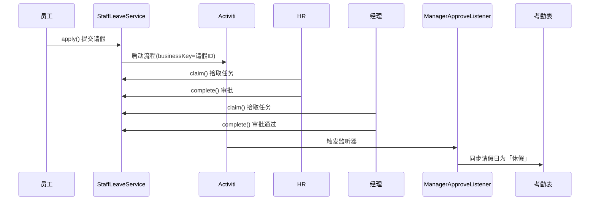

# Activiti 请假审批流程

## 流程图（BPMN）

```
[员工提交] → [HR 审批 hr_audit] → [经理审批 manager_audit] → 结束
                  ↓ 驳回                    ↓ 驳回
              [重新提交]               [重新提交]
```

流程定义文件：`src/main/resources/processes/leave.bpmn20.xml`

## 时序说明



## 关键点

| 概念 | 说明 |
|------|------|
| businessKey | 关联 `staff_leave` 业务表主键，流程与业务数据绑定 |
| 双数据源 | 业务库 `hrm` + 流程库 `hrm_activiti`，见 `DataSourceConfig.java` |
| claim | HR/经理拾取待办任务 |
| complete | 提交审批结果（通过/驳回） |
| ExecutionListener | 经理**通过**时触发，回写考勤（驳回不触发） |

## 核心类

| 类 | 路径 |
|----|------|
| StaffLeaveService | `service/StaffLeaveService.java` |
| HrApproveListener | `listener/HrApproveListener.java` |
| ManagerApproveListener | `listener/ManagerApproveListener.java` |
| leave.bpmn20.xml | `resources/processes/leave.bpmn20.xml` |
| DataSourceConfig | `config/DataSourceConfig.java` |
