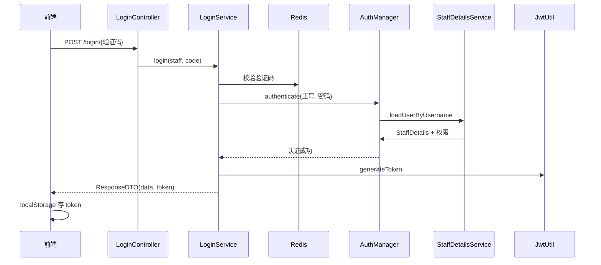
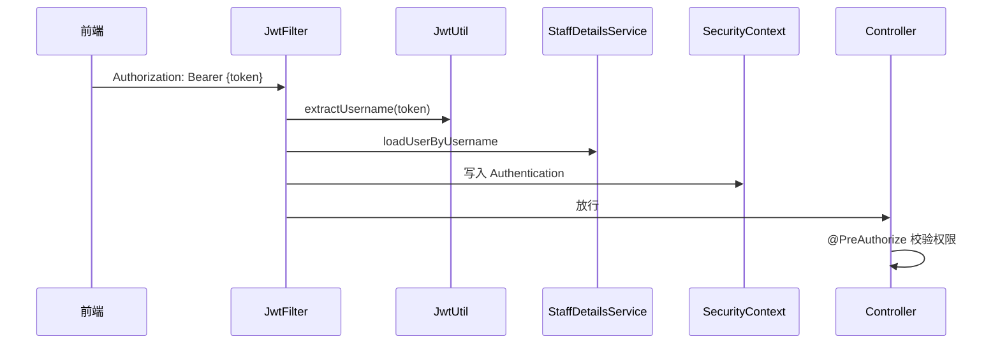

# JWT 鉴权流程

## 登录流程

## 请求鉴权流程

## 401 vs 403

| 场景 | 处理器 | 业务码 |
|------|--------|--------|
| 未带 Token / Token 无效 | AuthenticationEntryPointHandler | 1200 |
| 已登录但权限不足 | AccessDeniedExceptionHandler | 1300 |

## 核心类

| 类 | 路径 |
|----|------|
| JwtAuthenticationFilter | `filter/JwtAuthenticationFilter.java` |
| SecurityConfig | `config/SecurityConfig.java` |
| StaffDetailsService | `service/StaffDetailsService.java` |
| JwtUtil | `util/JwtUtil.java` |
